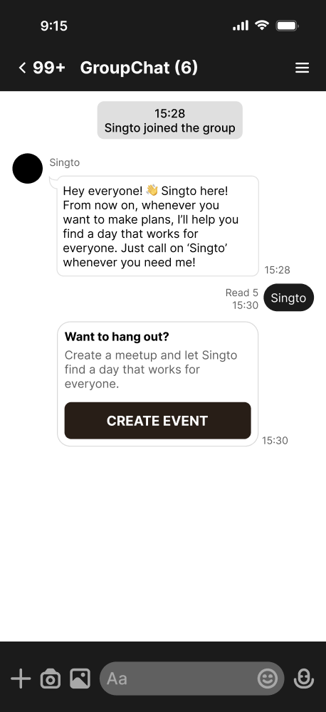
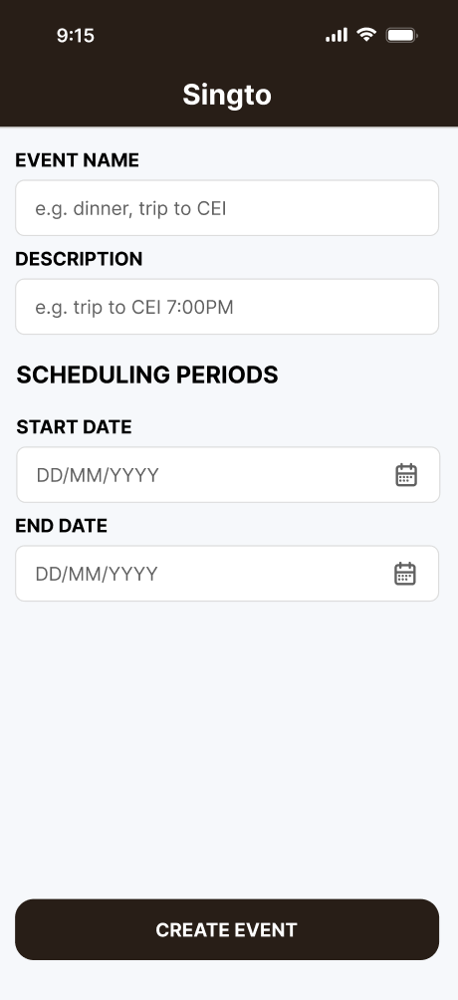
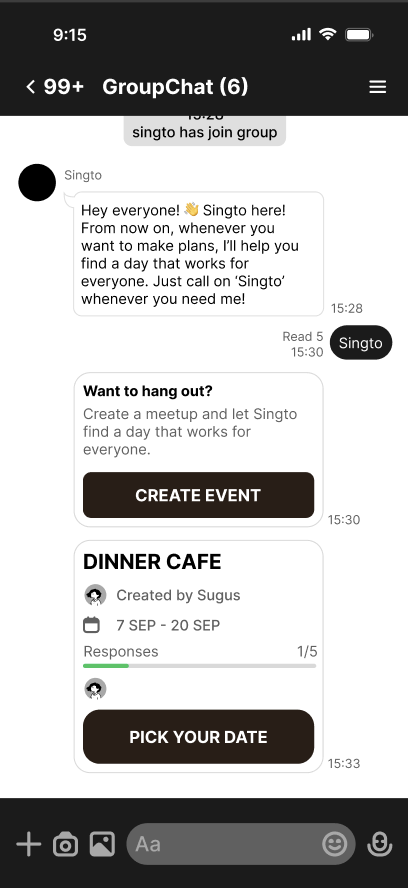
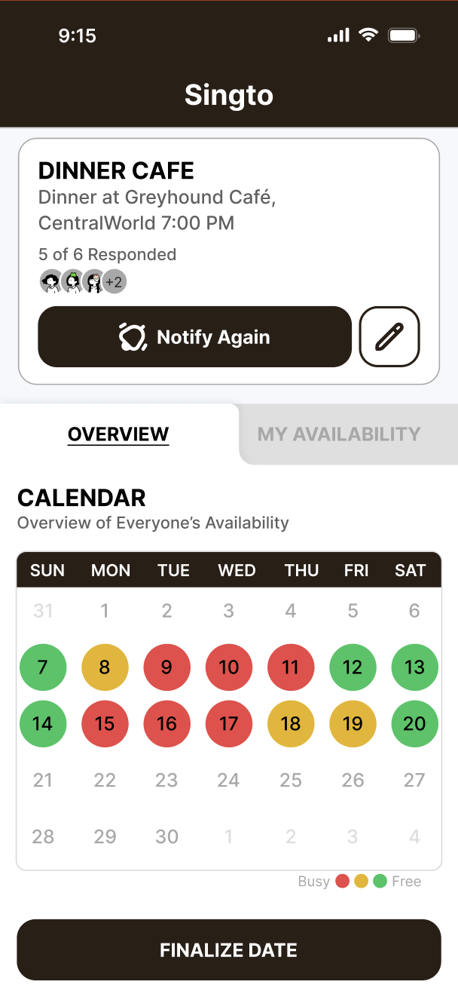
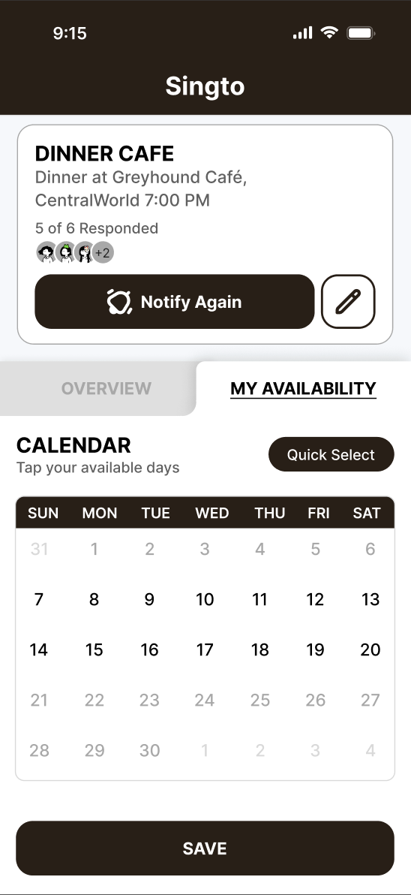
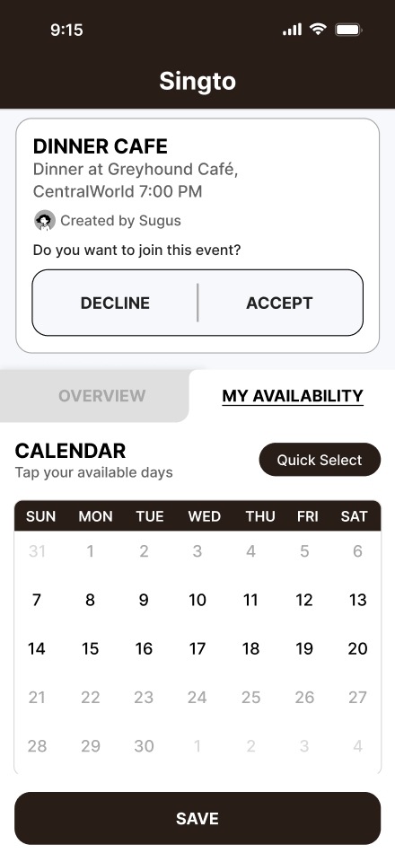
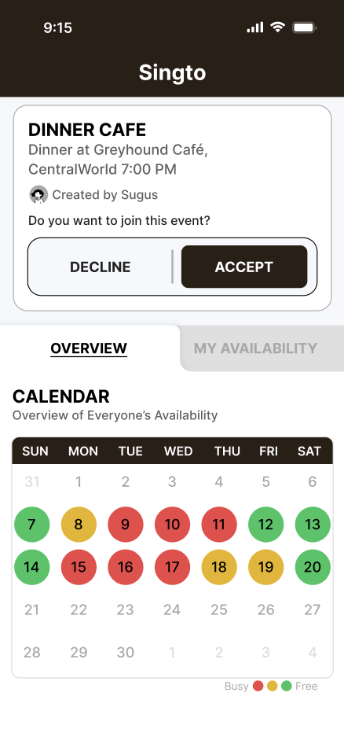
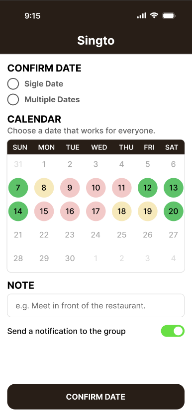
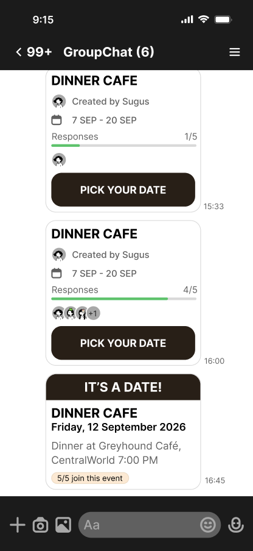

# Prototype — Singto

## 1. Prototype Overview

The Singto prototype demonstrates the complete group scheduling workflow from inviting Singto into a LINE group to creating an appointment, collecting participants' availability, identifying common available dates, confirming the final appointment date, and notifying participants through LINE.

The prototype focuses on a simple, mobile-first scheduling experience. Users only need to select the dates they are available. Dates that are not selected are treated as unavailable for scheduling purposes. This reduces the interaction required from users and avoids asking them to explicitly mark every date as either available or unavailable.

---

## 2. Prototype Flow

The main prototype flow is:

**Call Singto → Create an Appointment → Share Scheduling Link → Submit Availability → View Availability Overview → Identify Suitable Dates → Confirm Appointment → Receive Reminder/Confirmation**

The prototype contains six main stages:

1. Call Singto and create an appointment
2. Enter appointment details
3. Share the scheduling link through LINE
4. Collect and analyze participants' availability
5. Confirm the final appointment date
6. Notify participants through LINE

---

# 3. Screens

## Screen 1 — Call Singto and Create an Event

**User:** Organizer

The organizer starts the scheduling process by calling Singto in a LINE group.

The organizer can select the option to create a new appointment.

**Main interaction:**
- Organizer calls/interacts with Singto in the LINE group.
- Organizer selects **Create Event**.
- Singto opens the event creation interface.

   

**Next:** 

---

## Screen 2 — Create Appointment

**User:** Organizer

The organizer enters the basic information for the appointment.

### Information fields

- **Event Name**
- **Description**
- **Scheduling Period**
  - Start date
  - End date

The organizer then selects **Create Event** to create the appointment.

After creation, the system generates the appointment and prepares a shared scheduling link.

**Main interaction:**

`Enter Details → Select Scheduling Period → Create`

   

**Next:**

---

## Screen 3 — Share Scheduling Link Through LINE

**User:** Organizer / Participants

After the appointment is created, Singto sends a message to the LINE group.

The message contains information about the appointment and provides a link for participants to enter their availability.

Participants can select the link to join the scheduling process and choose the dates they are available.

   

**Main interaction:**

`Appointment Created → Singto sends LINE message → Participants open scheduling link`

**Next:**

---

# 4. Availability and Overview

## Screen 4.1 — Organizer View

**User:** Organizer

The organizer's scheduling page contains an appointment status card and two main sections:

- **Overview**
- **My Availability**

The organizer can switch between the two sections.

---

### 4.1.1 Appointment Status Card

At the top of the page, the organizer can see a summary of participation and response status.

The card displays information such as:

- Number of participants who have joined the appointment
- Number of participants who have not responded yet

This allows the organizer to quickly understand the current response status.

---

### 4.1.2 Overview

The **Overview** section provides the organizer with a summary of participants' availability.

A calendar displays the availability status of each date using visual indicators:

- **Green** — everyone who has responded is available
- **Yellow** — some participants are unavailable
- **Red** — many participants are unavailable

The overview also provides a summary of dates with the highest number of available participants.

The organizer can use a filter to view suitable results, including consecutive available dates when relevant.

When the organizer selects a specific date on the calendar, the result section changes to display details for that date, including:

- Participants who marked the date as available
- Participants who did not mark the date as available
- The overall availability for the selected date

A fixed **Set Date** button is displayed at the bottom of the screen.

   

---

### 4.1.3 My Availability

The **My Availability** section allows the organizer to submit their own available dates in the same way as other participants.

The organizer can select available dates directly from a calendar.

#### Date Selection Interaction

- Tap a date once → mark the date as **available**
- Tap the selected date again → remove the availability selection
- Dates that are not selected are treated as unavailable

The organizer can update their availability at any time.

The page also provides quick selection options to reduce the effort required to select multiple dates.

Example quick-select options:

- Select All
- Weekends
- Every Monday
- Every Tuesday
- Every Wednesday
- Other days of the week

The organizer can save or update their availability after making changes.

  

---

## Screen 4.2 — Participant View

**User:** Participant

The participant's scheduling page follows a similar structure to the organizer view but provides fewer permissions.

The page contains:

- Appointment information and participation status
- **Overview**
- **My Availability**

---

### 4.2.1 Appointment Information

At the top of the page, participants can view the appointment details.

The participant can also indicate whether they want to participate in the appointment.

   

---

### 4.2.2 Overview

Participants can view the group's availability overview.

However, this section is **view-only**.

Participants can:

- View the calendar
- View availability indicators
- View summarized available dates
- View availability details for a selected date

Participants cannot modify the group's availability information or set the final appointment date.

   

---

### 4.2.3 My Availability

Participants can select their own available dates using the calendar.

The interaction is the same as the organizer's availability selection:

- Tap once → mark as available
- Tap again → remove availability
- Unselected dates are treated as unavailable

Participants can update their availability at any time.

Quick-select options are also provided:

- Select All
- Weekends
- Every Monday
- Every Tuesday
- Every Wednesday
- Other days of the week

Participants can save or update their availability after making changes.

   

---

### 4.1 / 4.2 Availability Logic

Singto uses a simple availability model:

> **Selected date = Available**  
> **Unselected date = Unavailable**

Users are not required to manually select both "Available" and "Unavailable" for every date.

The system primarily uses the dates marked as available when comparing participants' schedules.

This approach reduces the number of interactions required from users and makes the scheduling process faster and simpler.

---

# 5. Screen 5 — Set Final Appointment Date

**User:** Organizer

After reviewing participants' availability, the organizer selects **Set Date** to determine the actual appointment date.

The page displays the appointment information at the top.

The organizer can choose between two scheduling modes:

- **Single Day**
- **Multiple Days**

The organizer then selects the required date or date range from the calendar.

The calendar uses the same availability information shown in the Overview section to help the organizer make the final decision.

---

## 5.1 Single Day

When **Single Day** is selected:

- The organizer selects one date from the calendar.
- The selected date becomes the proposed appointment date.

---

## 5.2 Multiple Days

When **Multiple Days** is selected:

- The organizer selects a continuous range of dates.
- The selected dates must be consecutive.

### Validation

If the organizer selects non-consecutive dates while using **Multiple Days**, the system displays a short validation message.

Example:

> **Please select consecutive dates.**

The organizer must modify the selection before continuing.

---

## 5.3 Additional Appointment Options

The organizer can also:

- Add an optional note
- Enable or disable the appointment reminder

The organizer then selects **Confirm Date** to finalize the appointment.

   

**Main interaction:**

`Review Availability → Set Date → Select Single/Multiple Days → Select Date → Add Note → Reminder On/Off → Confirm`

**Next:** → Screen 6

---

# 6. Screen 6 — Appointment Confirmation in LINE

**User:** Organizer / Participants

After the organizer confirms the appointment, Singto sends a confirmation message to the LINE group.

The message informs participants that the organizer has selected the final appointment date.

The confirmation message contains the confirmed appointment information, including:

- Appointment name
- Confirmed date
- Optional note

If the reminder option was enabled, Singto also schedules the reminder for the confirmed appointment.

   

**End of main scheduling flow.**

---

# 7. Prototype Interaction Summary

| Screen | User | Main Purpose | Key Action |
|---|---|---|---|
| Screen 1 | Organizer | Start scheduling | Create Appointment |
| Screen 2 | Organizer | Enter appointment details | Create |
| Screen 3 | Organizer / Participants | Share scheduling process | Open Scheduling Link |
| Screen 4.1 | Organizer | View and manage availability | Review / Set My Availability |
| Screen 4.2 | Participant | View and submit availability | Submit My Availability |
| Screen 5 | Organizer | Confirm final appointment date | Set Date → Confirm |
| Screen 6 | Organizer / Participants | Communicate final appointment | View Confirmation |

---

# 8. Design Goals

The prototype follows the project's main design principles:

- **Simple** — minimize unnecessary interactions.
- **Clear** — make group availability easy to understand.
- **Mobile-First** — support users primarily accessing the system through smartphones.
- **Efficient** — reduce repeated communication and manual comparison.
- **Consistent** — use consistent calendar interactions and visual indicators throughout the scheduling process.

The prototype prioritizes the core problem of helping groups identify a suitable date without requiring participants or organizers to manually compare everyone's availability.